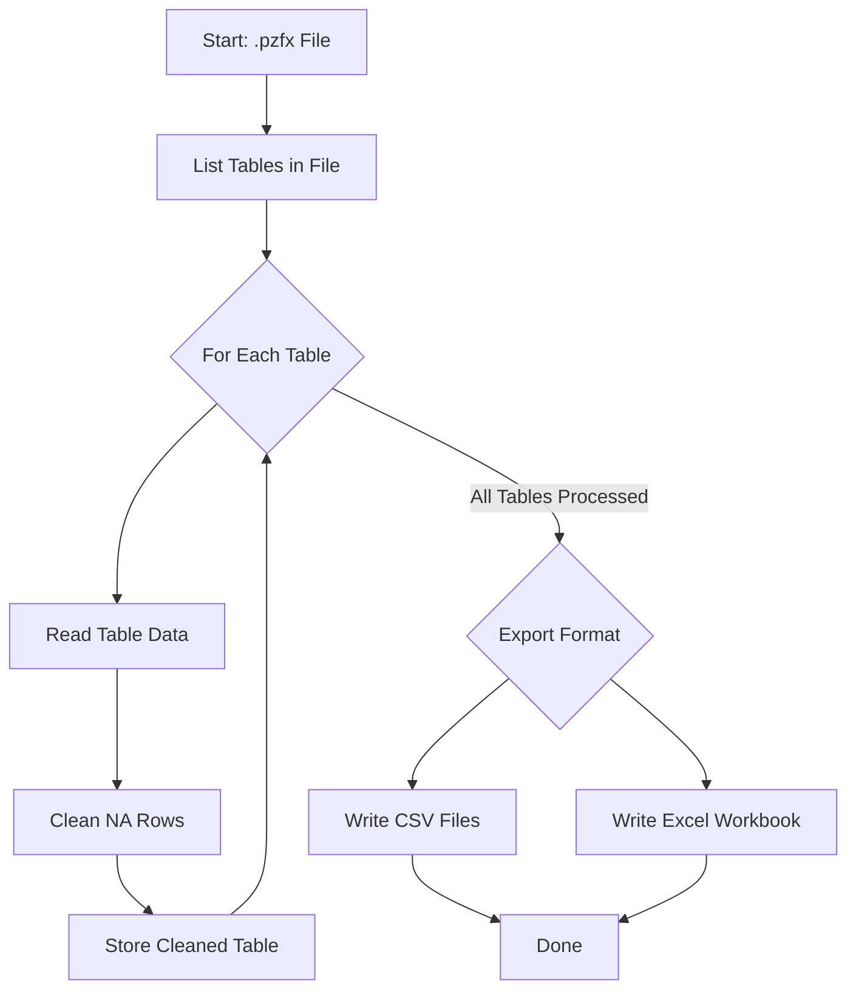

# Graphpad Export

The `graphpadexport` package provides functions to facilitate the transition from GraphPad Prism
files (.pzfx) to more universally compatible formats, such as .csv and .xlsx. This package extracts
tables from GraphPad Prism .pzfx files and converts them into CSV or Excel format using R. It is
designed for users with no programming background and provides detailed instructions for every step
of the process.

## Dependencies

The package requires the following dependencies:

-   [pzfx](https://cran.r-project.org/package=pzfx): For reading Prism files.
-   [openxlsx](https://cran.r-project.org/package=openxlsx): For writing Excel files.

These will be installed automatically when you install `graphpadexport`.

## Functions

### `clean_na_rows`

``` r
clean_na_rows(df)
```

Removes rows from a data frame where all values are `NA`.

**Arguments:** - `df`: A data frame to be cleaned.

**Returns:** - A data frame with rows where all values are `NA` removed.

----------------------------------------------------------------------------------------------------

### `pzfx_to_csv`

``` r
pzfx_to_csv(file_path, output_dir = getwd())
```

Converts tables from a `.pzfx` file into CSV format. Saves each table as a separate CSV file in the
specified output directory.

**Arguments:** 
- `file_path`: The path to the `.pzfx` file. 
- `output_dir`: The directory where CSV files will be saved. Defaults to the current working directory.

**Returns:** 
- Saves CSV files in the specified directory.

----------------------------------------------------------------------------------------------------

### `pzfx_to_xlsx`

``` r
pzfx_to_xlsx(file_path, output_dir = getwd())
```

Converts tables from a `.pzfx` file into an Excel workbook. Each table is added as a separate sheet.

**Arguments:** 
- `file_path`: The path to the `.pzfx` file. 
- `output_dir`: The directory where the Excel file will be saved. Defaults to the current working directory.

**Returns:** 
- Saves an Excel file in the specified directory with each table as a separate sheet.

## Step-by-Step Instructions

### Install R and RStudio:

1.  Visit the [R Project website](https://cran.r-project.org/) to download and install the latest
    version of R.
2.  Visit the [RStudio website](https://posit.co/download/rstudio-desktop/) to download and install
    RStudio. 
    
### Install Packages:

After installing R and RStudio:

Install remotes:

```r
install.packages("remotes")
```

install the `graphpadexport` package with the following command:

``` r
remotes::install_github("rcgsheffield/graphpadexport")
```


---

> ⚠️ **Important Note on File Paths**  
> If you are copying in file paths please make sure to replace all backslashes (`\`) with forward slashes (`/`).  
> R expects file paths like this:  
> ✅ `"C:/Users/YourName/Documents/example.pzfx"`  
> ❌ `"C:\Users\YourName\Documents\example.pzfx"`

---


### Use the Functions:

#### Open RStudio and load the graphpadexport package:

``` r
library(graphpadexport)
```

#### Convert .pzfx to CSV:

Use the `pzfx_to_csv()` function to convert the tables in your `.pzfx` file to CSV:

``` r
pzfx_to_csv("path/to/your/file.pzfx", "path/to/output/directory")
```

This will save the tables as separate CSV files in the specified directory. 

#### Convert .pzfx to XLSX: 

Use the `pzfx_to_xlsx()` function to convert the tables in your `.pzfx` file to an Excel file:

``` r
pzfx_to_xlsx("path/to/your/file.pzfx", "path/to/output/directory")
```

This will save an Excel file with each table as a separate sheet.

## Example

Here's a full example of how to use the `graphpadexport` package:

``` r
# Load the package
library(graphpadexport)

# Convert a .pzfx file to CSV
pzfx_to_csv("path/to/your/file.pzfx", "path/to/output/directory")
# Convert a .pzfx file to XLSX
pzfx_to_xlsx("path/to/your/file.pzfx", "path/to/output/directory")
```

After running these functions, you'll have clean CSV and/or Excel files ready for further analysis
or sharing.

## How it works





## License

This package is licensed under the MIT License. See the LICENSE file for more details.
